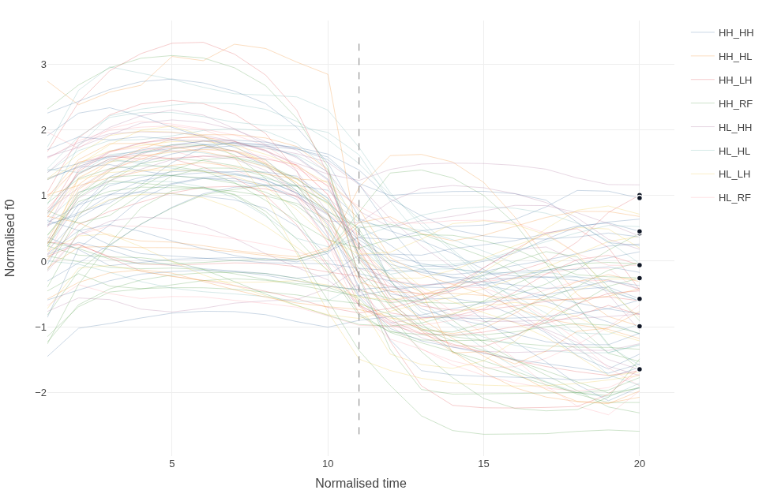
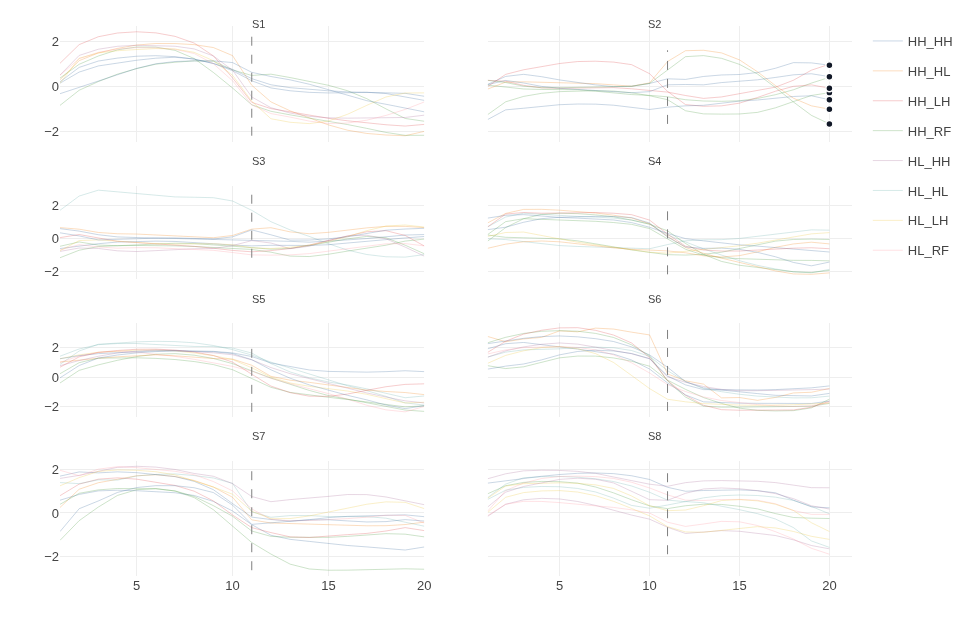

# Inspectour

**Inspecting f0 contours through grouping and comparison.**

Inspectour is a Shiny app for looking at normalised f0 trajectories when you do
not yet know what the categories are. It shows every contour in a dataset at
once, with nothing assumed, and lets you group, colour, facet, isolate and
label them interactively until the structure in the data becomes visible.

It is aimed at fieldwork on under-described prosodic systems, where the usual
two options are both awkward: transcription flattens the acoustic detail you
are trying to reason about, and clustering needs parameter decisions — and a
reasonable number of tokens per category — that you often cannot make yet.
Inspectour sits in between, as a way of seeing how many contour shapes are
actually present before or alongside any formal analysis.

<p align="center">
  
</p>

## Try it in one click

Clone the repository, open it in R, and run:

```r
# install once
install.packages(c("shiny", "ggplot2", "plotly", "dplyr",
                   "tidyr", "readr", "DT", "scales"))

shiny::runApp(".")
```

Then open the **Data** page and press **Try it with sample data**. That loads
`data/sample_data.csv.gz`: 85 disyllabic tone-sandhi contours from 8 speakers.
Press **Try it with sample audio** as well to load a short excerpt of one
speaker's recording with its Praat TextGrid, so you can click a contour and
hear it. See [`data/README.md`](data/README.md) for the columns.

## What you can do

| | |
|---|---|
| **See everything at once** | Every token is drawn, with no category imposed. Overlap is the point: it is what tells you whether two shapes are really distinct. |
| **Group and compare** | Colour by any variable, facet by one or two more. Checking whether a pattern survives across speakers is one click. |
| **Mark structure** | Draw a boundary line wherever a column changes within a token (syllable, word, phrase), or disconnect the contour there entirely. |
| **Switch scale** | Move between individual tokens, group means with ±1 SD ribbons, or means drawn over the tokens they summarise. |
| **Single out tokens** | Click a line to select it, or search by token id. Selection and search stay in sync. |
| **Listen** | Click a contour to hear it. Clips are cut on the fly from long recordings, located through Praat TextGrids, so you don't need one file per token. |
| **Record decisions** | Label the current selection, build up a curation log, undo, and export the whole dataset with your labels attached as a new column. |

<p align="center">
  
</p>

## Your own data

Inspectour expects **long format** — one row per time point per token:

| column | role |
|---|---|
| time | numeric position within the token (1…n) |
| f0 | the value to plot; a normalised column such as `norm_f0` is picked up automatically if present |
| token id | one column that uniquely identifies a single recorded token |
| speaker | speaker identifier |
| anything else | any number of grouping variables — tone category, syntactic structure, elicitation condition, and so on |

Column roles are guessed on load and can be reassigned on the Data page, so
your column names don't have to match anything. If no single column identifies
a token, you can combine several (for example speaker + item + condition).

### Audio (optional)

Recordings can be supplied as one WAV file per token, named by its token id, or
as long recordings with a Praat TextGrid. In the TextGrid case you say which
part of each interval label (and of the file name) holds each identifying
column, and the app matches intervals to tokens, including tokens that span
several intervals, such as one per syllable. Only uncompressed PCM WAV is
supported.

## Code layout

`app.R` is intentionally thin. Shiny sources every file in `R/` before running
the app:

| file | contents |
|---|---|
| `R/helpers.R` | constants and small helpers shared by the UI and server |
| `R/textgrid.R` | Praat TextGrid reader (short and long text formats) |
| `R/wavclip.R` | cuts one interval out of a WAV file without reading the whole file |
| `R/audio_match.R` | matches TextGrid intervals to dataset tokens |
| `R/ui.R` | the page layout |
| `R/server.R` | all reactive logic |

## Tests

```bash
Rscript tests/test_app.R
```

Checks the audio pipeline on the bundled recording (TextGrid reading, token
grouping, matching to the dataset, clip extraction), then drives the server with
`shiny::testServer`: data loading, column auto-detection, every plotting path
(tokens, means, means over tokens, single and grid faceting, boundary and
disconnect modes) and loading the sample audio.

## Citing

See [`CITATION.cff`](CITATION.cff).

## Licence

MIT — see [`LICENSE`](LICENSE).
